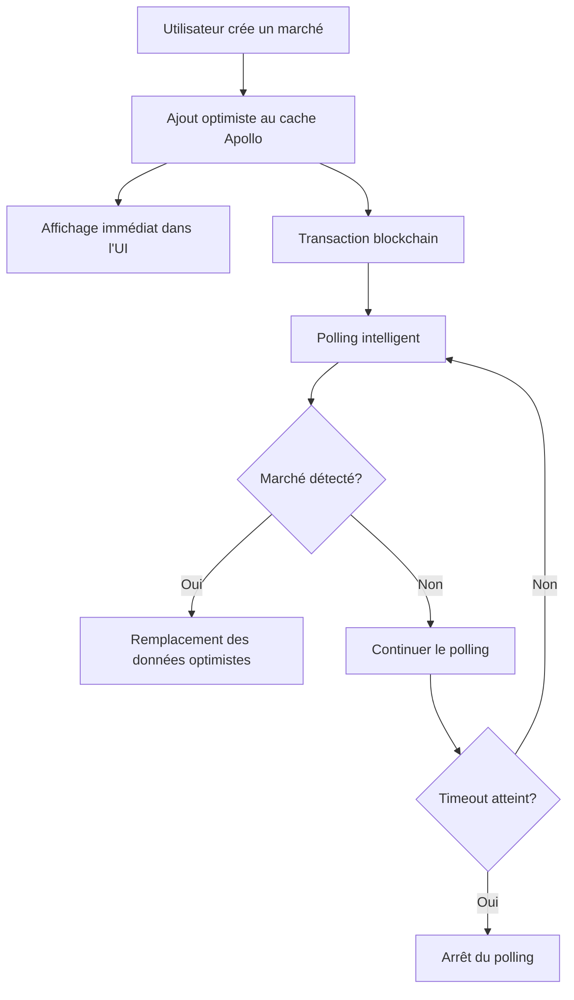

# 🚀 Documentation du Cache Optimiste

## Vue d'ensemble

Cette documentation décrit l'implémentation complète du **cache optimiste** pour améliorer l'expérience utilisateur lors de la création et de l'affichage des marchés. Le système permet d'afficher immédiatement les marchés créés, même avant leur confirmation sur la blockchain.

## 📋 Table des matières

1. [Architecture](#architecture)
2. [Fichiers créés](#fichiers-créés)
3. [Fichiers modifiés](#fichiers-modifiés)
4. [Composants](#composants)
5. [Hooks personnalisés](#hooks-personnalisés)
6. [Configuration Apollo](#configuration-apollo)
7. [Utilisation](#utilisation)
8. [Page de démonstration](#page-de-démonstration)
9. [Stratégie technique](#stratégie-technique)
10. [Dépannage](#dépannage)

## Architecture

### Principe de fonctionnement



### Flux de données

1. **Création optimiste** : Ajout immédiat au cache avec ID temporaire
2. **Affichage instantané** : L'UI se met à jour automatiquement
3. **Polling intelligent** : Vérification périodique sur le subgraph
4. **Synchronisation** : Remplacement des données optimistes par les vraies données
5. **Nettoyage** : Suppression des données temporaires

## Fichiers créés

### 🔧 Configuration et utilitaires

#### `src/lib/graphql-fragments.ts`
```typescript
// Fragments GraphQL réutilisables pour les requêtes de marchés
export const MARKET_LIST_FRAGMENT = gql`
  fragment MarketListFragment on Market {
    id
    title
    description
    # ... autres champs
  }
`
```

#### `src/hooks/useOptimisticMarket.ts`
```typescript
// Hook personnalisé pour la gestion du cache optimiste
export function useOptimisticMarket() {
  const addOptimisticMarket = (marketData) => {
    // Logique d'ajout optimiste
  }
  
  const removeOptimisticMarket = (marketId) => {
    // Logique de suppression
  }
  
  return { addOptimisticMarket, removeOptimisticMarket }
}
```

### 🎨 Composants UI

#### `src/components/OptimisticMarketsList.tsx`
- **Fonction** : Affiche la liste des marchés avec support optimiste
- **Props** :
  - `limit?: number` - Nombre maximum de marchés à afficher
  - `showOptimistic?: boolean` - Afficher les marchés optimistes
  - `className?: string` - Classes CSS personnalisées

#### `src/components/MarketCreator.tsx`
- **Fonction** : Interface de création de marché avec feedback optimiste
- **Fonctionnalités** :
  - Formulaire de création
  - Ajout optimiste automatique
  - Gestion des erreurs
  - Feedback visuel

#### `src/components/MarketPolling.tsx`
- **Fonction** : Démontre le système de polling
- **Props** :
  - `marketId: string` - ID du marché à surveiller
  - `contractAddress?: string` - Adresse du contrat
  - `onMarketDetected?: (market) => void` - Callback de détection

#### `src/components/MarketDisplay.tsx`
- **Fonction** : Affichage détaillé d'un marché avec cache-first
- **Props** :
  - `marketId: string` - ID du marché à afficher
  - `className?: string` - Classes CSS

### 📄 Pages

#### `src/app/optimistic-demo/page.tsx`
- **Fonction** : Page de démonstration complète
- **Sections** :
  - Liste optimiste
  - Créateur de marché
  - Démonstration du polling
  - Affichage de marché

## Fichiers modifiés

### ⚙️ Configuration Apollo

#### `src/lib/apollo-client.ts`
```typescript
// Configuration mise à jour pour le cache optimiste
export function getApolloClient() {
  return new ApolloClient({
    cache: new InMemoryCache({
      typePolicies: {
        Market: {
          fields: {
            engagements: {
              merge(existing = [], incoming) {
                return incoming
              },
            },
          },
        },
      },
    }),
  })
}
```

#### `src/app/ApolloProvider.tsx`
```typescript
// Provider Apollo mis à jour
export function ApolloClientProvider({ children }) {
  const client = getApolloClient()
  return <ApolloProvider client={client}>{children}</ApolloProvider>
}
```

#### `src/app/layout.tsx`
```typescript
// Intégration du provider dans le layout
export default function RootLayout({ children }) {
  return (
    <html>
      <body>
        <ApolloClientProvider>
          {children}
        </ApolloClientProvider>
      </body>
    </html>
  )
}
```

#### `src/components/CreateMarketModal.tsx`
- **Modifications** : Intégration du hook `useOptimisticMarket`
- **Nouvelles fonctionnalités** :
  - Ajout optimiste lors de la création
  - Feedback visuel amélioré
  - Gestion d'erreur optimiste

## Composants

### OptimisticMarketsList

**Utilisation :**
```tsx
import { OptimisticMarketsList } from '@/components/OptimisticMarketsList'

<OptimisticMarketsList 
  limit={20}
  showOptimistic={true}
  className="custom-class"
/>
```

**Fonctionnalités :**
- Affichage des marchés réels et optimistes
- Indicateurs visuels pour les marchés en cours de synchronisation
- Tri et filtrage automatique
- Mise à jour en temps réel

### MarketCreator

**Utilisation :**
```tsx
import MarketCreator from '@/components/MarketCreator'

<MarketCreator />
```

**Fonctionnalités :**
- Formulaire de création complet
- Validation des données
- Upload IPFS des métadonnées
- Ajout optimiste automatique
- Gestion des erreurs

### MarketPolling

**Utilisation :**
```tsx
import { MarketPolling } from '@/components/MarketPolling'

<MarketPolling 
  marketId="optimistic-0x123..."
  contractAddress="0x456..."
  onMarketDetected={(market) => console.log('Détecté:', market)}
/>
```

**Fonctionnalités :**
- Polling automatique toutes les 3 secondes
- Arrêt automatique à la détection
- Timeout après 20 tentatives
- Feedback visuel du statut

### MarketDisplay

**Utilisation :**
```tsx
import MarketDisplay from '@/components/MarketDisplay'

<MarketDisplay 
  marketId="market-id-or-contract-address"
  className="custom-display"
/>
```

**Fonctionnalités :**
- Stratégie cache-first
- Affichage détaillé du marché
- Gestion des états de chargement
- Support des marchés optimistes

## Hooks personnalisés

### useOptimisticMarket

**Utilisation :**
```tsx
import { useOptimisticMarket } from '@/hooks/useOptimisticMarket'

function MyComponent() {
  const { addOptimisticMarket, removeOptimisticMarket } = useOptimisticMarket()
  
  const handleCreateMarket = async (marketData) => {
    // Ajout optimiste
    const optimisticId = addOptimisticMarket(marketData)
    
    try {
      // Transaction blockchain
      const result = await createMarketOnBlockchain(marketData)
      // Le polling se charge automatiquement de la synchronisation
    } catch (error) {
      // Suppression en cas d'erreur
      removeOptimisticMarket(optimisticId)
    }
  }
}
```

**Méthodes disponibles :**
- `addOptimisticMarket(marketData)` : Ajoute un marché optimiste
- `removeOptimisticMarket(marketId)` : Supprime un marché optimiste
- `isOptimisticMarket(marketId)` : Vérifie si un marché est optimiste

## Configuration Apollo

### Cache Policy

```typescript
const cache = new InMemoryCache({
  typePolicies: {
    Market: {
      fields: {
        engagements: {
          merge(existing = [], incoming) {
            return incoming // Remplace complètement les données
          },
        },
      },
    },
  },
})
```

### Fetch Policy

- **cache-first** : Pour l'affichage rapide des marchés
- **network-only** : Pour les requêtes de polling
- **cache-and-network** : Pour les listes avec mise à jour en temps réel

## Utilisation

### 1. Création d'un marché optimiste

```tsx
import { useOptimisticMarket } from '@/hooks/useOptimisticMarket'
import { useCreateMarket } from '@/hooks/useCreateMarket'

function CreateMarketForm() {
  const { addOptimisticMarket } = useOptimisticMarket()
  const { createMarket } = useCreateMarket()
  
  const handleSubmit = async (formData) => {
    // 1. Ajout optimiste immédiat
    const optimisticId = addOptimisticMarket({
      title: formData.title,
      description: formData.description,
      // ... autres données
    })
    
    // 2. Transaction blockchain
    try {
      await createMarket(formData)
      // Le polling se charge de la synchronisation
    } catch (error) {
      // Nettoyage en cas d'erreur
      removeOptimisticMarket(optimisticId)
    }
  }
}
```

### 2. Affichage avec cache optimiste

```tsx
import { OptimisticMarketsList } from '@/components/OptimisticMarketsList'

function MarketsPage() {
  return (
    <div>
      <h1>Marchés</h1>
      <OptimisticMarketsList 
        limit={50}
        showOptimistic={true}
      />
    </div>
  )
}
```

### 3. Surveillance d'un marché

```tsx
import { MarketPolling } from '@/components/MarketPolling'

function MarketWatcher({ optimisticMarketId }) {
  return (
    <MarketPolling 
      marketId={optimisticMarketId}
      onMarketDetected={(realMarket) => {
        console.log('Marché synchronisé:', realMarket)
        // Actions supplémentaires si nécessaire
      }}
    />
  )
}
```

## Page de démonstration

### Accès
Rendez-vous sur `/optimistic-demo` pour tester toutes les fonctionnalités.

### Sections disponibles

1. **Liste Optimiste** (`/optimistic-demo?tab=list`)
   - Visualisation de tous les marchés
   - Indicateurs pour les marchés en cours de synchronisation

2. **Créateur** (`/optimistic-demo?tab=create`)
   - Interface de création de marché
   - Démonstration de l'ajout optimiste

3. **Polling** (`/optimistic-demo?tab=polling`)
   - Test du système de surveillance
   - Saisie d'ID de marché optimiste

4. **Affichage** (`/optimistic-demo?tab=display`)
   - Test de l'affichage détaillé
   - Stratégie cache-first

### Scénario de test complet

1. **Créer un marché :**
   - Aller sur l'onglet "Créateur"
   - Remplir le formulaire
   - Cliquer sur "Créer"
   - ✅ Le marché apparaît immédiatement

2. **Vérifier la liste :**
   - Aller sur l'onglet "Liste Optimiste"
   - ✅ Voir le marché avec l'indicateur "En cours de synchronisation"

3. **Observer la synchronisation :**
   - Attendre quelques secondes
   - ✅ L'indicateur disparaît quand le marché est confirmé

4. **Tester le polling :**
   - Copier l'ID d'un marché optimiste
   - Aller sur l'onglet "Polling"
   - Coller l'ID
   - ✅ Voir le système de détection en action

## Stratégie technique

### Gestion des IDs

- **Marchés optimistes** : `optimistic-${timestamp}-${random}`
- **Marchés réels** : ID du contrat ou hash de transaction

### Polling intelligent

```typescript
const POLLING_INTERVAL = 3000 // 3 secondes
const MAX_POLLING_ATTEMPTS = 20 // 1 minute maximum

// Logique de polling
const pollForMarket = async (optimisticId, contractAddress) => {
  let attempts = 0
  
  const poll = async () => {
    if (attempts >= MAX_POLLING_ATTEMPTS) {
      console.log('Timeout de polling atteint')
      return
    }
    
    const market = await searchMarketOnSubgraph(contractAddress)
    if (market) {
      replaceOptimisticMarket(optimisticId, market)
    } else {
      attempts++
      setTimeout(poll, POLLING_INTERVAL)
    }
  }
  
  poll()
}
```

### Gestion d'erreur

1. **Erreur de transaction** : Suppression du marché optimiste
2. **Timeout de polling** : Conservation avec indicateur d'erreur
3. **Erreur de réseau** : Retry automatique
4. **Données invalides** : Validation côté client

### Performance

- **Cache Apollo** : Évite les requêtes redondantes
- **Polling intelligent** : Arrêt automatique à la détection
- **Lazy loading** : Chargement progressif des marchés
- **Debouncing** : Limitation des requêtes de recherche

## Dépannage

### Problèmes courants

#### Le marché optimiste n'apparaît pas

**Causes possibles :**
- Hook `useOptimisticMarket` non utilisé
- Cache Apollo mal configuré
- Erreur dans les données du marché

**Solutions :**
```typescript
// Vérifier l'utilisation du hook
const { addOptimisticMarket } = useOptimisticMarket()

// Vérifier les données
console.log('Données du marché:', marketData)

// Vérifier le cache
console.log('Cache Apollo:', client.cache.extract())
```

#### Le polling ne fonctionne pas

**Causes possibles :**
- URL du subgraph incorrecte
- Adresse de contrat invalide
- Problème de réseau

**Solutions :**
```typescript
// Vérifier la configuration
console.log('Subgraph URL:', process.env.NEXT_PUBLIC_GRAPHQL_HTTP_URL)

// Tester manuellement
const testQuery = await client.query({
  query: GET_MARKET_QUERY,
  variables: { marketId: contractAddress }
})
```

#### Les données ne se synchronisent pas

**Causes possibles :**
- ID de marché incorrect
- Cache non mis à jour
- Erreur dans la logique de remplacement

**Solutions :**
```typescript
// Forcer la mise à jour du cache
client.cache.evict({ fieldName: 'markets' })
client.cache.gc()

// Vérifier les IDs
console.log('ID optimiste:', optimisticId)
console.log('ID réel:', realMarket.id)
```

### Debug

#### Activer les logs Apollo

```typescript
const client = new ApolloClient({
  // ... configuration
  defaultOptions: {
    watchQuery: {
      errorPolicy: 'all',
    },
  },
})

// Log des requêtes
client.setLink(
  from([
    new ApolloLink((operation, forward) => {
      console.log('GraphQL Query:', operation.operationName)
      return forward(operation)
    }),
    httpLink,
  ])
)
```

#### Inspecter le cache

```typescript
// Dans les DevTools
window.__APOLLO_CLIENT__ = client

// Puis dans la console
__APOLLO_CLIENT__.cache.extract()
```

### Variables d'environnement requises

```env
# .env.local
NEXT_PUBLIC_GRAPHQL_HTTP_URL=https://your-subgraph-url
NEXT_PUBLIC_IPFS_GATEWAY=https://your-ipfs-gateway
```

## Conclusion

Cette implémentation du cache optimiste améliore significativement l'expérience utilisateur en :

- ✅ **Feedback immédiat** : Les marchés apparaissent instantanément
- ✅ **Synchronisation transparente** : Mise à jour automatique avec les vraies données
- ✅ **Gestion d'erreur robuste** : Nettoyage automatique en cas de problème
- ✅ **Performance optimisée** : Cache intelligent et polling efficace
- ✅ **Interface intuitive** : Indicateurs visuels clairs

La page de démonstration `/optimistic-demo` permet de tester toutes ces fonctionnalités de manière interactive.

---

**Auteur :** Assistant IA  
**Date :** $(date)  
**Version :** 1.0.0